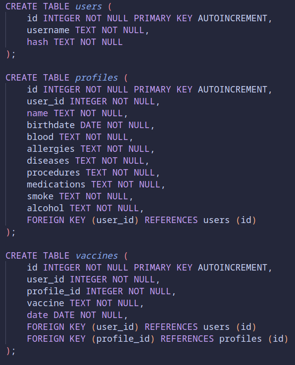

# Health Tools

## Description:

Health Tools is a web application that allows individuals to keep track of various health-related information. Users can add profiles for themselves and relatives, which records characteristics such as allergies, medicines and immunization for each person. The application also provides a BMI calculator that supports both metric and imperial measurement systems and a collection of healthy practices that can be used to achieve a better state of well-being.

The motivation behind the application was to create an easy-to-use and straightforward website that would help people become more responsible with their health. We live in a highly connected world in which we're constantly inundated with all kinds of knowledge and, precisely because of that, we may even find ourselves neglecting essential information. In regards to our health, Health Tools is an approach to solving this problem.

The project was built in Python using the Flask framework. It also uses SQLite3, HTML, CSS, and Bootstrap 5.

The logo was created using Figma.

## Video Demo:

The following video showcases Health Tools and how to use all of it's functionalities! 

Video: https://youtu.be/1qldnvUjp_Y

As seen in the demonstration, Health Tools has three main features:

**Unique profiles** — Each user can create a number of profiles that have their own particularities.

**Easy-to-use BMI calculator** — A simple interface to calculate the Body Mass Index and help users measure their overall health.

**Collection of healthy practices** — A list of many habits that contribute to a more fullfilling life.

## Understanding the Project:

**venv/** — Python Virtual Environment. It works by keeping the dependencies separated from other projects.

**templates/** — It's where all the HTML is stored. 

**static/** — It's where the images, logo, favicon, and CSS stylesheet are stored.

**app.py** — This is the main part of the project, responsible for the implementation of the routes and the configuration of Flask and SQLite3.

**helpers.py** — This is an auxiliary file to keep the functions _'is_valid'_ and _'login_required'_ in a separated place.

## Database:

Health Tools utilises the SQL Database SQLite3.

**htools.db** — It's a simple database that allows users to register and create a number of profiles that have their own immunization tables.The structure is as follows:

## How to Launch the Application:

1) Clone this github repository: `git clone https://github.com/Thiagoalves033/Final_Project.git`
2) Open the CLI inside the downloaded folder
3) Activate the enviroment by using: `. venv/bin/activate`
4) Run the Flask application by using: `flask run`
5) Inside your browser, go to: `localhost:5000`
